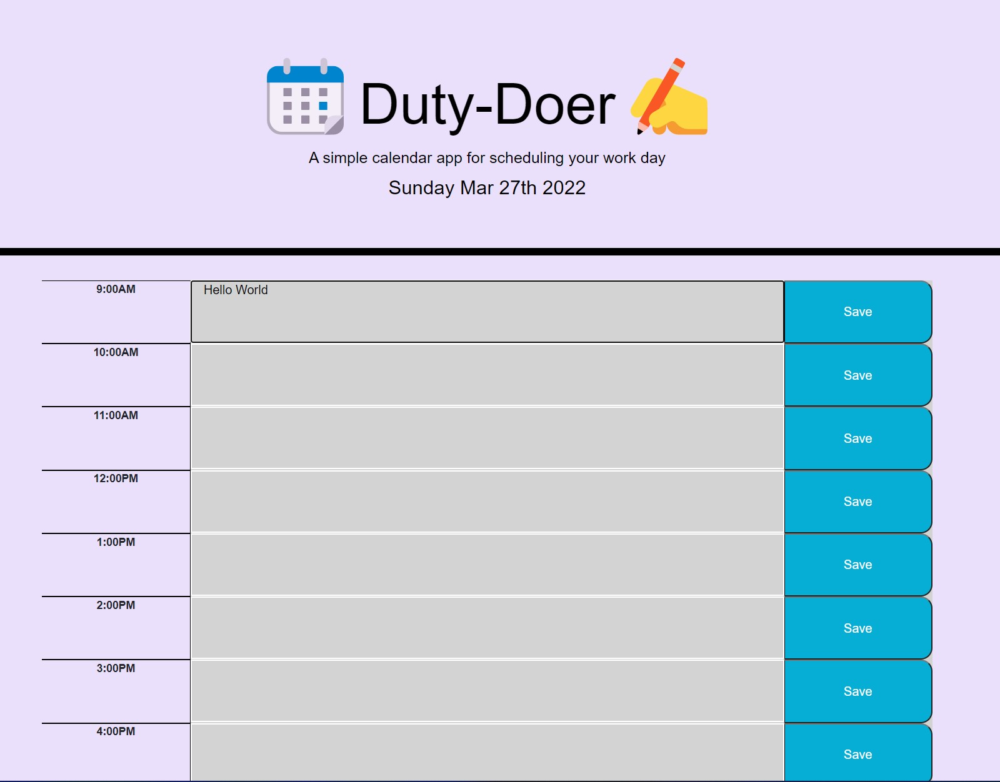

# Duty-Doer, Inc,

## Purpose
"A simple calendar app for scheduling your workday"

Keep track of your workday in real-time!  This app connects directly to your web browers LocalStorage through JavaScript, to save your itinerary.  The app comes with many features including also posting the current date on top and color coordinating your events by the hour.  Red for the current hour, green for future workplace hours, and grey for the work hours that already passed.

Keep your plans organized, it's fast and easy, give it a try!

## Built With
* HTML
* CSS
* JavaScript

## Website
* https://salvadorbanuelos424.github.io/Horiseon/

## GitHub URL
* https://github.com/SalvadorBanuelos424/Random-Password-Generator.git

## Contributing
Made with ❤️ by Salvador Banuelos

### © 2022 Duty-Doer, Inc.